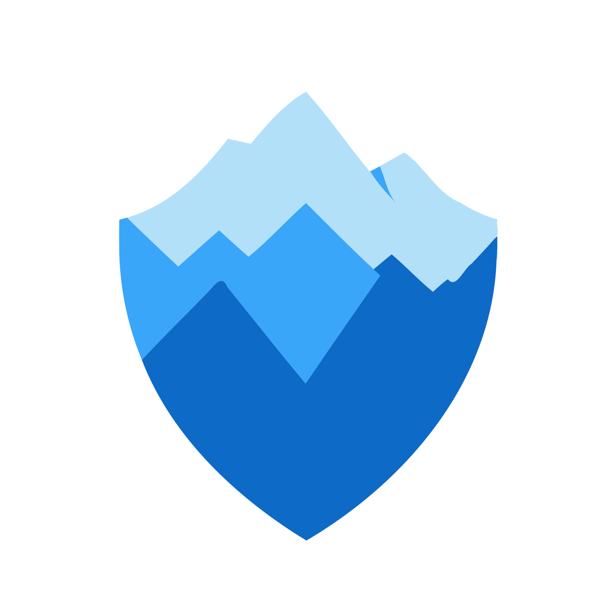

#  Misti
Misti is a static analysis tool designed for smart contracts on the [TON blockchain](https://ton.org/).

### Language Support
- [Tact](https://tact-lang.org/): 25 detectors [are available](https://nowarp.io/tools/misti/docs/next/detectors)
- [FunC](https://docs.ton.org/develop/func/overview) support is [planned](https://github.com/nowarp/misti/issues/56) by the end of the year

### Use Cases
- **Detect Code Issues**: Identify and fix potential [security flaws and code problems](https://nowarp.io/tools/misti/docs/detectors) early in the development cycle.
- **Streamline Development**:
  [Integrate](https://nowarp.io/tools/misti/docs/tutorial/ci-cd) Misti into your CI/CD pipeline to ensure continuous code quality checks.
- **Custom Detectors**: Create [custom detectors](https://nowarp.io/tools/misti/docs/hacking/custom-detector) to solve specific problems in your code or to provide a thorough security review if you are an auditor.

## Getting Started
1. Install Soufflé according to [the official installation instruction](https://souffle-lang.github.io/install).

2. Misti is distributed via npm and should be added to your Tact project [in the same way](https://github.com/tact-lang/tact?tab=readme-ov-file#installation) as Tact itself:
```bash
yarn add @nowarp/misti
```

3. Run Misti by specifying a Tact project configuration:
```bash
npx misti path/to/your/tact.config.json
```

See [Misti Configuration](https://nowarp.io/tools/misti/docs/tutorial/getting-started/) for available options, or [Developing Misti](https://nowarp.io/tools/misti/docs/next/hacking/developing-misti) for advanced instructions. Blueprint users should refer to the [appropriate documentation page](https://nowarp.io/tools/misti/docs/tutorial/blueprint).

## Resources
- **[Misti Documentation](https://nowarp.github.io/tools/misti/)**: Comprehensive guide on detectors, architecture, and development.
- **[Misti API Reference](https://nowarp.github.io/tools/misti/api)**: Useful for contributors or developers creating custom detectors.
- **[Misti Blueprint Plugin](https://github.com/nowarp/blueprint-misti)**: A plugin for the Blueprint Framework to enhance your workflow.
- **[Misti Discussion Group](https://t.me/misti_dev)**: Join the conversation.
